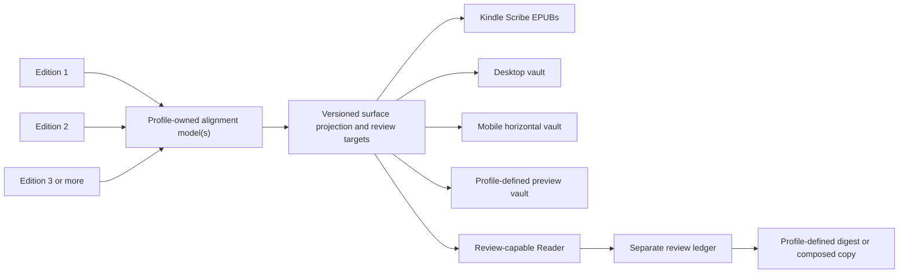

# Rosetta

Rosetta is a general comparative editorial format for aligned editions of one
work. It keeps corresponding sense units together, exposes meaningful
differences without flattening them, and stores editorial judgments separately
from every source text.

The format is implemented in more than one project. This guide defines the
shared Rosetta model and then gives two concrete profiles:

- the Russian translation Rosetta for *The Invented Enemy*;
- the edition-and-voice Rosetta for *Lighthouse Republics*, also called the
  Venice Rosetta.

Rails, feature vectors, alignment rules, and post-processing are
profile-specific. A score of 80 in one profile must never be compared with 80
in another.

This FirstPair document is the canonical cross-project reader and format
guide. The Enemy implementation remains source-owned in
`~/src/review/invented`; its local build and validator contract is
`~/src/review/invented/docs/TRANSLATION-TRIPTYCH.md`, and its isolated editing
trial is specified in
`~/src/review/invented/docs/TRANSLATION-TRIPTYCH-EDITABLE-PREVIEW.md`. The
current Venice vault implementation is owned by
`~/src/venezia/usavenice`; its delivered S/E/W Kindle artifacts are retained
with the style-branch workspace at `~/src/venezia/usavenice-codex-hemingway`.

Last verified against the local artifacts and source implementation:
2026-07-31.

## 1. Core model and project profiles

A Rosetta consists of:

- two or more source snapshots bound to stable identities;
- a lossless alignment into ordered sense units;
- one pane and edition identity for every source represented in a unit;
- a profile-defined editorial rail;
- reflowable reader surfaces that preserve the alignment;
- stable structural targets for durable review choices;
- provenance and validators that bind every surface to its sources.

Three panes are common, hence “triptych,” but not required. Venice supports
pairs, triptychs, and larger configured comparison sets. The format term is
**Rosetta**; **triptych** describes a particular three-pane set.

| Profile | What varies | Typical active rail | Principal editorial question |
|---|---|---|---|
| *The Invented Enemy* | Three Russian translations | `F / R / C` | Which Russian wording should enter the next reviewed translation? |
| *Lighthouse Republics* | English editions and voice lines | `S / E / W` or another configured set | What changed across editions, and what should a future edition retain? |

### The Invented Enemy edition rail

Each Rosetta page compares the same aligned sense chunk in a fixed order:

| Letter | Edition | Role in the present project | Source |
|---|---|---|---|
| **F** | Fable | First independent translation | `~/src/invented`, branch `russian/fable` |
| **R** | Codex Review | Reviewed translation and normal base for a new revision | `~/src/review/invented`, branch `russian/fable-codex` |
| **C** | Codex | Earlier Codex translation | `~/src/russophobia`, branch `russian/sol` |

The letters identify editions; they are not grades. Rosetta does not decide a
winner by majority vote. Its normal editorial workflow begins with R and then
records deliberate chunk, sentence, word, or phrase choices from any column.

### Lighthouse Republics edition rails

The mature voice triptych uses:

| Letter | Edition | Active source ID | Voice role |
|---|---|---|---|
| **S** | South | `south-2.2.1-final` | Canonical prose lineage; documentary-republican voice |
| **E** | East | `east-2.2.1-final` | Quieter, reflective variant |
| **W** | West | `west-2.2.2-final` | Spare, direct variant |

Venice is not limited to S/E/W. Comparison sets are declared in
`~/src/venezia/usavenice/book/obsidian/triptych-sets.json` and currently include a pair, two
three-edition histories, and a four-pane **Edition 4 Decision** set. In those
sets, the pane title or configured short label—not a universal fixed
letter—carries edition identity.

The final edition listed in a Venice set supplies stable book-order navigation;
that position does not make it the editorial winner.

### What makes a Rosetta version

A Rosetta version is the reproducible combination of:

- the profile and ordered source-edition identities;
- exact source commits or content-inventory hashes;
- alignment contract and any reviewed overrides;
- comparison-set configuration and pane order;
- payload, route, control, and decision schema versions;
- builder version, artifact hashes, and generation timestamp.

Changing prose, alignment, pane membership, or a review-target fingerprint
creates a new source identity. A layout-only change may preserve the same
structural targets, but it still produces a separately hashed artifact. Enemy
records the source identity and hashes in `VERSION.md` and the triptych report;
Venice binds immutable edition versions and commits in its Reader indexes and
generated manifests.

## 2. One aligned model, several reading surfaces

EPUBs and vaults preserve one or more profile-owned, version-bound alignments
rather than silently realigning prose for each device. A project may use
separate builders, alignments, or worktrees for different delivery surfaces,
provided each surface's provenance names its exact alignment and sources.



The available surfaces are:

| Surface | Scope | Typical layout | Principal use |
|---|---|---|---|
| Clean Scribe EPUB | Complete book | One table row per configured Kindle pane | Unscored comparative reading |
| Scored Scribe EPUB | Complete book | Pane rows with full rails | Editorial navigation on Kindle Scribe |
| Desktop vault | Complete book or configured edition graph | Vertical stack or wide columns | Close comparison on a large screen |
| Mobile vault | Complete book or configured edition graph | Horizontally swipeable panes | Phone and tablet review |
| Preview vault | Bounded, provenance-linked subset | Project-defined | Safe review, testing, or public companion delivery |

Rosetta is reflowable: text remains selectable, accessible, searchable, and
attached to its edition rail.

## 3. Alignment and identity

Rosetta alignment is lossless, ordered, and profile-owned. A renderer may
reflow or repack aligned units, but it may not silently omit source material or
derive editorial identity from a screen coordinate or local page number.

### The Invented Enemy alignment

The translations retain the same chapter and heading architecture but do not
always retain the same paragraph or sentence boundaries. The builder therefore:

1. aligns headings by stable order within each chapter;
2. aligns paragraph spans inside each heading boundary using Russian
   content-word overlap, light stemming, sequence, length, and block kind;
3. refines the spans into sentence and clause units without breaking words;
4. packs adjacent units only while every F/R/C slice remains within the
   configured Kindle budget, normally 420 characters.

The result is lossless. The validator reconstructs a normalized linear copy of
each source and proves that no heading or prose block has been dropped,
duplicated, or reordered.

### Lighthouse Republics alignment

Venice aligns immutable edition snapshots rather than three translations with
one shared paragraph inventory. A source paragraph, quotation, list, table,
code block, or figure is an edition-specific sense unit. Cross-edition identity
lives in transformation events and conceptual lineage records.

Configured Rosetta sets project those lineages into ordered comparison
fragments. The alignment may group complete sentences or leave a pane sparse,
but it must keep style-branch sentences atomic; it must not split a shorter
sentence into word shards merely to imitate another edition's row count.
Manual literary decisions live in
`~/src/venezia/usavenice/book/obsidian/alignment-overrides.json`, never in
generated vault notes.

### Identity hierarchy

Every profile addresses editorial decisions structurally instead of by visible
page number. The common hierarchy is source identity → comparison fragment →
pane → finer review unit → selector.

In the Enemy profile:

- `source_content_id` binds the complete source inventories, alignment
  contract, slice budget, and canonical target inventory.
- A `fragment_key` identifies one aligned chunk, including whether it is a
  heading or prose fragment.
- An aligned-unit key identifies a sentence or clause within the fragment.
- Each nonempty pane unit carries its exact text, Unicode code-point range,
  and SHA-256 fingerprint.
- Each word token carries a unit-derived key, ordinal, exact text, code-point
  range, and fingerprint.
- A phrase selector records its ordered word-token keys, exact quotation, and
  bounded prefix and suffix context.

In the Venice profile:

- immutable edition IDs carry version and source-commit identity;
- transformation and lineage IDs connect edition-specific sense units;
- a fragment key has the durable form `{set-id}/{lineage-id}`;
- a pane may contain zero, one, or several whole source units;
- each pane refers to its edition-specific source unit instead of duplicating
  prose in the Reader index;
- generated sentence IDs carry normalized visible-text fingerprints;
- phrase annotations retain edition, unit, exact quotation, Unicode
  code-point offsets, and local context.

Desktop, mobile, and preview page numbers are deliberately absent from durable
targets. Matching identities make choices portable between compatible layouts,
but no profile silently copies or migrates a ledger. A changed source or text
fingerprint fails closed instead of attaching a stale choice to similar-looking
prose.

### Payload and route separation

A Rosetta Reader index is navigation metadata, not another manuscript. Prose
remains authoritative in the generated fragment note or referenced immutable
source unit and is loaded lazily.

In the Enemy profile, every chunk note contains one fenced
`invented-triptych` payload. Payload v2 holds the three panes, aligned units,
word tokens, scores, comparison marks, and stable identities.

`Reader/reader-index.json` is a compact route index. It knows ordered chapters,
pages, titles, and note paths but deliberately contains no F/R/C prose. The
Reader loads and validates the payload already present in the chunk note. This
keeps the dynamic Reader and the static Markdown fallback on the same text.

The current Enemy implementation uses these format layers:

| Layer | Current schema |
|---|---|
| Alignment | `invented.translation-alignment.v3` |
| Chunk payload | `invented.translation-triptych.v2` |
| Reader route | `invented.translation-triptych-reader.v1` |
| Review route/composition | `invented.translation-triptych-review.v1` |
| Review decisions | `firstpair.triptych-decisions.v4` |
| Editorial controls | `invented.translation-triptych-controls.v4` |
| Current vault manifest | `invented.translation-triptych-vault.v6` |

In the Venice desktop vault, fenced `triptych` payload schema 2 identifies
panes and source units while the Reader index schema 3 contains only sets,
parts, page routes, and immutable version/commit identity. Its mobile vault
uses compact triptych data that likewise references generated edition units
instead of embedding a second prose copy.

## 4. Edition rails

An edition rail keeps identity and compact editorial signals attached to the
pane they describe. Its exact fields belong to the project profile.

| Rail function | Enemy example | Venice example |
|---|---|---|
| Edition identity | `F`, `R`, `C` | `S`, `E`, `W` in the scored Kindle rail; full configured pane title in the vault |
| Primary score | `РУ 98` surface fluency | `37` divergence |
| Secondary score | `Δ48` divergence | None |
| Feature vector | Cyrillic `КЦДПМТИО` vocabulary, up to three hits | `NMSRECF` cells, up to three hits |
| Difference mark | `·`, `\|`, `\|\|`, `\|\|\|` | `·`, `❘`, `❘❘`, `❘❘❘` |
| Structural signal | Dotted edge for split/fusion | Dotted edge plus `split/fuse` flag |
| Equality | Vertical `F=C` or `F=R=C` chain | Top banner naming identical visible panes; `=` always appears when all equal |

In the Enemy Reader and Review, an actual heading page also carries a visible
**Heading** badge. This distinguishes the heading fragment from prose pages
that repeat the same section title only as context.

Both vault profiles use `·` as a visible zero-bar placeholder. Scored EPUBs may
leave the corresponding table-native mark cell empty. A `·` in a feature cell
means that feature is absent, not that the edition has failed a test.

These signals answer different questions. A high `РУ` score does not mean the
wording is faithful, and a large `Δ` does not mean it is bad. A highly fluent
independent recasting can receive both a high score and a large divergence.

## 5. Scoring profiles

Rosetta requires every score to have a named profile, range, feature glossary,
and limitations. Scores are navigation aids for human review. They are not
probabilities, truth values, or universal quality grades.

### Enemy: fluent-Russian score

`РУ` is an editorial triage heuristic, not an objective measure of literary
quality. It starts at 100 and subtracts deterministic surface penalties. It is
computed only for eligible prose-like slices containing at least six Russian
words; short headings and structural fragments display `—`.

The rail displays at most the three strongest diagnostics:

| Code | Russian label | What it detects |
|---|---|---|
| `К` | калька | Literal calque or anglicized construction |
| `Ц` | канцелярит | Bureaucratic, service-heavy, or nominalized prose |
| `Д` | длина | An overloaded sentence or uncontrolled long period |
| `П` | повтор | Intrusive repetition of content words |
| `М` | монотонность | Unusually uniform neighboring sentence lengths |
| `Т` | тяжесть | Participial, gerundive, or passive heaviness |
| `И` | иноязычность | Excessive Latin-script density in Russian prose |
| `О` | обрыв | A chain dominated by very short fragments |

The score is clamped to 0–100. Current display classes are high at 85 or above,
middle from 70 through 84, and low below 70. The overall edition score in the
report is a Russian-word-count-weighted mean of scored chunks; headings and
other unscored fragments do not dilute it.

The detector is intentionally interpretable and limited. It can point an
editor toward possible stiffness, repetition, or rhythm problems, but it
cannot assess factual fidelity, imagery, register, voice, historical nuance,
or whether a long sentence is artistically controlled. Those remain human
judgments, supplemented by the separate LitVoice work described in
`~/src/review/invented/docs/TRANSLATION-RU.md`.

### Enemy: divergence

`Δ` measures how far one pane is from the other two. The builder combines mean
lexical/sequence dissimilarity at 82% weight with normalized length difference
at 18% weight, then rounds the result to 0–100. Russian comparison tokens are
lowercased, lightly stemmed, and stripped of common stopwords. Similarity
combines set overlap, mutual coverage, and token-sequence agreement.

The bars provide a coarser navigation vocabulary:

- no bar: all three normalized texts are exactly equal;
- `|`: local difference;
- `||`: substantive difference, currently triggered by very low content-token
  overlap;
- `|||`: an outlier—this pane is substantially farther from the other two than
  they are from each other;
- dotted edge: the editions split or fuse sentence units differently while
  retaining enough similarity to treat the change as structural.

The outlier test is deliberately conservative. In the current implementation
it requires `Δ` of at least 58 and a difference of at least 0.24 between the
other pair's similarity and the pane's mean similarity.

### Venice: edition divergence and feature vector

The Venice 0–100 score measures difference, not prose quality. All-equal panes
are forced to zero; higher values direct attention to a more independently
changed fragment.

Its weighted components are:

- 55% mean dissimilarity from the other panes;
- 15% relative character-length difference;
- 15% relative sentence-count difference;
- 10% content tokens unique against the other panes;
- 5% distinctive rare-token difference.

The feature vector reports up to three strongest structural or stylistic
diagnostics:

| Code | Meaning |
|---|---|
| `N` | New sentence or claim |
| `M` | New image or metaphor |
| `S` | Sentence split |
| `R` | Distinctive rare diction |
| `E` | Expanded or longer than neighboring panes |
| `C` | Compressed or shorter than neighboring panes |
| `F` | Sentences fused |
| `=` | No feature threshold fired; all-equal panes always receive this code |

Venice treats `❘❘` as substantive addition, omission, or new claim and
`❘❘❘` as a review outlier. An outlier must score at least 40 and then either
lead the next-highest pane by at least ten points while carrying two features,
or, in a three-pane fragment, be materially less similar to both neighbors than
they are to each other. The dotted structural edge is independent of bars: it
marks split, fusion, or reorder when sentence counts differ but content still
aligns.

The `=` feature is not, by itself, proof of equality: it can also mean that no
N/M/S/R/E/C/F threshold fired. Only the explicit equality group or banner
claims normalized textual identity.

A sparse Venice pane displays `—`. Comparison hubs also use `P/S/D/A` badges
for present, same-hash, different-hash, and absent traversal states. Those
badges are not Rosetta scores or equality groups. Likewise, the graph aligner's
internal similarity and dynamic-programming score are not the displayed
divergence score.

### Shared mark vocabulary

Both profiles use the same editorial progression even though their glyphs and
thresholds differ:

- zero bars: shared or aligned;
- one bar: local tonal or lexical pressure;
- two bars: substantive divergence, addition, omission, or new claim;
- three bars: review outlier;
- dotted edge: structural difference rather than a quality judgment.

### Equality is profile-specific

Equality is always calculated separately from scoring, but its normalization
belongs to the profile.

The Enemy equality chain collapses whitespace only; wording remains case- and
`ё`-sensitive. It identifies the largest exact group in the chunk:

- `F=C`: Fable and Codex are identical;
- `F=R`: Fable and Codex Review are identical;
- `R=C`: Codex Review and Codex are identical;
- `F=R=C`: all three are identical;
- no chain: no pair is exactly identical.

In the EPUB and vertical desktop layout, the characters are stacked vertically.
The chunk-level equality chain is repeated on each F/R/C rail, including a
pane outside the equal group, so every row carries the same identity statement.

Venice equality lowercases and collapses whitespace. Its vault recomputes a top
banner over the visible panes, naming every equal group or displaying **All
shown panes are identical** when all visible panes match. A Venice equality
banner therefore must not be treated as byte identity or compared directly
with an Enemy equality count.

## 6. Reflowable Kindle editions

Rosetta EPUBs are reflowable and table-native. Each aligned sense unit is a
bounded EPUB spine item. Edition rails and comparison marks occupy dedicated
table cells so Kindle cannot turn a mark into a detached line above the prose
or lose a float during reflow. CSS Grid, floating gutters, fixed-page images,
and paragraph-internal mark rails are outside the active format.

### Enemy Kindle profile

Every sense chunk contains exactly one table with three ordered F/R/C rows.

The two complete EPUBs are:

- `invented-enemy-translation-triptych-scribe-rosetta.epub` — clean reader;
- `invented-enemy-translation-triptych-scribe-rosetta-scored.epub` — editorial
  reader with `РУ`, `Δ`, feature vectors, bars, structural marks, and equality
  chains.

The clean EPUB retains edition identity and exact equality but omits diagnostic
scoring. The scored EPUB is the normal editorial instrument. The browser QA
sample, `invented-enemy-translation-triptych-scribe-rosetta-preview.html`, uses
the same table and CSS rules.

The validator checks the configured character and estimated Scribe-height
budgets, exactly three rows, Russian package metadata, lossless coverage, and
ZIP integrity.

### Venice delivered Kindle profile

The delivered Venice S/E/W Rosetta follows the same reflowable table principle
but uses its divergence score and `N/M/S/R/E/C/F` feature vector:

- `us-venice-editorial-scribe-rosetta.epub` — clean comparative reader;
- `us-venice-editorial-scribe-rosetta-scored.epub` — scored comparative reader.

The clean EPUB labels panes with full **South**, **East**, and **West** names.
The scored EPUB uses the compact S/E/W initial, score, and seven fixed feature
slots. Literal `|`, `||`, and `|||` marks occupy a narrow table-native cell
between the rail and text. The structural dotted rule sits on that mark cell's
right edge. This geometry is a device-compatibility rule, not decoration.

These artifacts and `VERSION-editorial-scribe-rosetta.md` are retained under
`~/src/venezia/usavenice-codex-hemingway/book/dist/`. The current
`~/src/venezia/usavenice` commands below build the vault surfaces, not these
EPUB files; its Obsidian scoring implementation carries forward the same rail
vocabulary.

## 7. Obsidian vaults

Each project owns its plugin, payload, and ledger schemas, but the active vaults
share the same architectural rules: a prominent Reader link on `Home.md`, a
pinned hierarchical navbar, lazy use of authoritative prose, durable structural
targets, and complete static Markdown fallbacks.

Clean vault packages install the plugin for inspection but do not silently
enable it: `.obsidian/community-plugins.json` starts empty. Enable the local
project plugin deliberately after inspection. Without it, launchers, contents,
chapter or Part notes, and fragments remain navigable Markdown.

### Reader navigation

The Reader replaces the launcher, contents, chapter, or chunk note in the same
tab. Only the comparison body scrolls. One navbar remains pinned at the top in
this order:

`Previous | Up | Back | Top | TOC | Next`

- **Previous** and **Next** follow the active route and stop at its boundaries:
  complete-book chunk order in Enemy, configured-set fragment order in Venice.
- **Up** follows the profile hierarchy: chunk → chapter → contents in Enemy;
  fragment → Part → set → contents in Venice.
- **Back** restores internal Reader locations and scroll positions; the current
  history cap is fifty locations in Enemy and one hundred in Venice. It does
  not leave the Reader for an unrelated note.
- **Top** returns to the current surface's beginning.
- **TOC** opens the generated contents route.

At phone width the central tools become compact, touch-sized icon buttons while
Previous and Next retain the flexible outer tracks.

### Enemy desktop vault

The desktop vault stacks F, R, and C vertically. Each pane has a compact left
rail, making score and equality comparisons easy without horizontal movement.
This is the preferred complete-book layout for a large display.

Loose vault:
`~/src/review/invented/book/dist-triptych/The Invented Enemy Translation Triptych Desktop Vault/`

Archive:
`~/src/review/invented/book/dist-triptych/invented-enemy-translation-triptych-desktop-vault.zip`

### Enemy mobile vault

The mobile vault uses the same chunk pages but places F, R, and C on a
horizontally swipeable snap track. A visible edge hints at the next pane. F/R/C
tabs follow both taps and swipes, and every target remains touch-sized. The
static Markdown fallback still contains all three complete texts.

Loose vault:
`~/src/review/invented/book/dist-triptych/The Invented Enemy Translation Triptych Mobile Vault/`

Archive:
`~/src/review/invented/book/dist-triptych/invented-enemy-translation-triptych-mobile-vault.zip`

### Enemy editable preview vault

The preview is a private, isolated laboratory for the newest editing controls;
it is not the public book preview and not a replacement for either complete
vault. It contains exactly nine local Reader pages covering canonical chunks
27–35:

1. the Chapter 1 heading;
2. the chapter introduction;
3. the heading **Слово с двумя назначениями**;
4. the six prose chunks in that subsection.

Local pages 1–9 retain their complete-book fragment, unit, token, and canonical
order identities. The actual headings on local pages 1 and 3 display the
**Heading** badge; prose pages that repeat those titles do not.

Working vault:
`~/src/review/invented/book/dist-triptych/The Invented Enemy Translation Triptych Editable Preview Vault/`

Clean archive:
`~/src/review/invented/book/dist-triptych/invented-enemy-translation-triptych-editable-preview-vault.zip`

The loose working preview may contain private choices under `Preferences/`.
The clean ZIP is a separate, choice-free delivery artifact and is not rewritten
by a personal in-place UI update.

### Venice desktop vault

The Lighthouse desktop vault is a wide editorial graph rather than only a
linear book. A triptych fragment displays one side-by-side column per visible
edition, with global pane-visibility chips. At narrow widths the columns move
onto a horizontal overflow track instead of collapsing into an unreadable
stack. The same vault also exposes edition units, transformation events,
lineages, entities, sources, and configurable comparison hubs.

Vault:
`~/src/venezia/usavenice/book/dist-obsidian/Lighthouse Republics Vault/`

### Venice mobile vault

The Lighthouse mobile Reader exposes complete editions and configured Rosetta
sets in one full-page route. A triptych advances one conceptual slice at a
time; panes swipe horizontally. Back restores the Reader location, vertical
position, horizontal pane position, and exact link or footnote reference.
Static Part and slice notes retain top-and-bottom navigation when the plugin is
disabled.

Vault:
`~/src/venezia/usavenice/book/dist-obsidian/Lighthouse Republics Mobile Vault/`

### Venice preview vault

The Lighthouse Preview Vault is a clean public companion to the book preview,
not a private editing sandbox. It contains the complete front matter and Part I
across the **Edition 4 Decision** comparison set, with in-scope sense units,
events, lineages, scores, figures, and filtered graph records and indexes.
Out-of-scope links are flattened so the preview is self-contained.

Every preview build replaces `.obsidian/` and `Preferences/`; private editorial
state must never enter it or rely on it as the sole copy of decisions.

Vault:
`~/src/venezia/usavenice/book/dist-obsidian/Lighthouse Republics Preview Vault/`

### Three different meanings of preview

- The Enemy browser QA HTML previews Kindle rendering only.
- The Enemy editable preview vault is a private nine-page control laboratory.
- The Venice Preview Vault is a clean, bounded public companion artifact.

These outputs have different privacy and preservation contracts even though
all contain the word “preview.”

## 8. Editorial controls by profile

Rosetta never edits visible source prose in place. Controls write structured
judgments to a separate project ledger, using the stable identities described
above. Opening a fine-control panel or changing visible panes does not itself
record an editorial decision.

### Enemy controls

Every Enemy page exposes an always-visible, mutually exclusive
`Overall F | R | C` preference. It selects the base edition for the whole
chunk; clicking the active letter again clears the choice.

`Sentence & words` is initially hidden and local to the rendered page. Opening
it reveals one mutually exclusive F/R/C preference for each aligned sentence
or clause and a **Words** button for every nonempty pane unit.

Inside **Words**:

- **Whole sentence** selects the complete sentence;
- each canonical word has a phrase-selection checkbox;
- each word also has an **Only** action for selecting that word alone;
- adjacent checked words form one phrase inside one pane and one aligned unit.

The saved actions are:

- **Good** — retain this wording as a candidate for explicit use;
- **Bad** — record a defect for the next pass; Bad wording cannot be inserted
  into the composed copy;
- **Edit** — record replacement wording while preserving the original target.

Saving clears only the transient word checkboxes, so another phrase can be
selected immediately. One selection must be contiguous inside one pane and one
aligned unit. Separately saved selections may overlap, nest, or cross-overlap;
all remain independently visible and editable. Selecting the exact same span
again changes that span's single Good/Bad/Edit state.

Clicking an edited highlight reopens its variants beneath the action row.

- **Save & replace** changes the preferred variant in place.
- **Save next** retains the existing wording and appends another timestamped
  variant.
- The variants are stacked in the phrase preview.
- Exactly one checkbox selects the `preferred_variant_id` used by composition.

To edit a heading such as **Слово с двумя назначениями**, open the Reader page
whose title carries the **Heading** badge, then use **Sentence & words → Words**
and **Edit** on the heading text. The same title may appear on neighboring prose
pages as navigation context; those repetitions are not the heading target. Map
the saved heading Edit in Review just like a prose Edit before exporting the new
copy.

### Venice controls

Venice exposes a different review contract because its panes represent edition
history rather than three candidates for one immediately composed translation.

In the complete desktop vault and its bounded preview derivation:

- Edition chips show or hide panes globally; visibility is a reading setting,
  not an editorial judgment.
- **prefer this** is mutually exclusive across the panes of one fragment and
  records the whole-fragment winner.
- A compact editing note records an imperative instruction for that fragment.
- **Sentence & words** is page-local and hidden by default. It reveals an
  independent preference and **Words** button for every nonempty sentence or
  heading unit. Sentence preferences are not forced into mutually exclusive
  cross-pane groups because split and fused editions do not guarantee
  one-to-one sentence alignment.
- Inside **Words**, **Whole sentence** selects the complete unit, adjacent
  word checkboxes select one contiguous phrase, and **Only** selects one word.
- A selection can be marked **Good**, **Bad**, or **Edit**. Saved phrases may
  overlap, nest, or cross-overlap and remain independently addressable.
- An existing Edit reopens its stacked correction variants. **Save & replace**
  changes the preferred wording in place; **Save next** appends another
  timestamped option; one checkbox identifies the preferred variant retained
  in the digest.
- A heading unit carries the **Heading** badge, so a structural title can be
  reviewed without confusing it with repeated navigation context.

The peer **Review** view lists only touched pages, links each card back to its
Reader fragment, and renders the deterministic decision digest. Venice records
evidence and replacement proposals but does not compose a manuscript from
conceptual lineages whose source units can split, fuse, repeat, or move. Its
mobile vault remains a separately built horizontal reading product; do not
infer desktop decision persistence from mobile layout alone.

## 9. Enemy Review and R-first assembly

The Enemy profile adds a peer **Review** view and a composed-copy engine. Reader
records judgments; Review lists only pages with saved choices, links each one
back to its Reader page, and shows a complete **New copy preview** for the
vault's scope.

The normal base is Codex Review (R), stored as
`copy_settings.default_edition_key`. Composition precedence is:

1. a sentence preference for that aligned unit;
2. otherwise a chunk preference for that page;
3. otherwise the default edition, normally R;
4. finally, explicit Good/Edit phrase replacements mapped into the effective
   base unit.

This means an editor who changes only a few phrases does not need to make an
overall or sentence choice on every page.

### Assemble a revision from a few phrase changes

1. Leave **R** selected as the default edition in Review.
2. In Reader, open the relevant page and enable **Sentence & words**.
3. Click **Words** in the desired F, R, or C sentence and select the phrase.
4. Choose **Good** to reuse those exact F/C words, **Edit** to supply corrected
   wording, or **Bad** only to record feedback. To revise R directly, select the
   original R phrase and choose **Edit**.
5. If an Edit has several variants, use **Save & replace** or **Save next** and
   check the preferred variant.
6. Open **Review**. In the edited page card, click **Use in copy** for that Good
   or Edit annotation.
7. Select the exact destination words in the effective base copy—R unless a
   chunk or sentence preference overrides it—and save the mapping. For a direct
   R edit while R is effective, select the original R words themselves. If an
   override makes F or C effective, select the destination there or clear the
   override first.
8. Repeat for the other changes. The **New copy preview** updates as the
   mappings are saved.
9. Inspect the complete preview, then click **Save review copy**.

The composed order can be summarized as:

`R base → optional chunk choice → optional sentence choice → mapped Good/Edit phrases`

### Why phrase insertion is explicit

A Good mark alone does not identify what it should replace in the final copy.
`copy_phrase_uses` therefore links the saved source annotation to an exact
destination range in the currently effective base edition. The destination
stores its unit hash, exact quote, context, range, and edition.

An Edit mapping inserts its checked preferred variant. A Good mapping inserts
the source phrase exactly. Mappings within one destination unit may not overlap.
Composition applies them in ascending destination-offset order against the
unchanged unit snapshot so earlier replacements cannot shift later Unicode
offsets. Stale, ambiguous, cross-unit, Bad, or overlapping mappings fail
closed.

## 10. Venice decision digest and next-edition workflow

Venice does not assemble a new manuscript inside the Reader. Its normal output
is an explicit instruction digest for a separate edition pass:

1. In the desktop vault, open **Triptych Reader** and choose the relevant
   configured set. The working set for fourth-edition review is **Edition 4
   Decision**.
2. Use the global edition chips to establish a readable comparison; this does
   not affect the ledger.
3. For each changed fragment, choose the preferred whole pane and add a compact
   imperative note when the choice needs qualification.
4. Reveal **Sentence & words** only where sentence-level evidence helps. More
   than one edition's sentence may be preferred in the same fragment.
5. Open **Words**, select an exact word, contiguous phrase, or **Whole
   sentence**, and mark it **Good**, **Bad**, or **Edit**. Start another
   selection whenever a second or overlapping phrase needs its own record.
6. For an Edit, use **Save & replace** to update its preferred wording or
   **Save next** to retain several variants, then check the preferred one.
7. Open **Review** to inspect every touched page and its digest entry.
8. Run **Export editing instructions digest** to regenerate
   `Preferences/EDITING-INSTRUCTIONS.md` from the structured ledger.
9. Use that digest verbatim as editorial input to the next-edition pass, review
   the resulting manuscript, then rebuild the Venice Rosetta against a new
   immutable edition identity.

Whole-fragment choices, sentence choices, and phrase annotations all remain in
the digest. No control silently rewrites an edition snapshot.

## 11. Persistence, integrity, and recovery

Each profile keeps authoritative decisions separate from generated notes and
source manuscripts:

| Profile | Structured state | Human-readable output |
|---|---|---|
| Enemy | `Preferences/translation-triptych-decisions.json` plus `.sha256` sidecar | `Preferences/TRANSLATION-EDITING-INSTRUCTIONS.md` |
| Venice | `Preferences/triptych-decisions.json` plus `.sha256` sidecar | `Preferences/EDITING-INSTRUCTIONS.md` |

Enemy writes are serialized and validated. JSON and the integrity sidecar are
written to temporary files, read back, validated, and installed with rollback
backups. The Markdown digest follows the authoritative JSON commit; a digest
write failure does not corrupt valid choices. Unsupported schemas, integrity
or source-identity mismatches, stale targets, and I/O errors preserve the last
valid state and reject the attempted write.

There is no ordinary **Preserve previous choices** button. If a changed Enemy
manuscript has actual nonempty choices, Review shows a source-mismatch recovery
panel whose scope is the complete saved review state. Only there may the editor
archive the JSON, sidecar, and digest under `Preferences/archive/` before
starting an empty review for the new source identity. Missing or empty choice
files reset silently and are not presented as archive candidates.

The Venice v4 ledger stores whole-fragment preferences and notes, independent
sentence preferences, Good/Bad/Edit phrase selectors, correction histories,
preferred variants, project identity, and exact source-content identity. Its
JSON, integrity sidecar, and deterministic digest are committed as one checked
transaction with rollback. Generated pane hashes, sentence fingerprints,
Unicode word-token maps, and per-page target digests are checked before
controls attach, so changed text cannot silently inherit a judgment. The digest
is regenerated on each change and can also be rebuilt explicitly with the
export command.

## 12. Outputs and source promotion

### Enemy composed copy

**Save review copy** writes two files without altering F, R, or C:

- `Review/Exports/translation-review-copy.md` — the assembled Russian text;
- `Review/Exports/translation-review-copy.json` — composition provenance and
  choices for inspection or machine replay.

Merely opening Review never writes an export. In a complete vault, the Markdown
file can be a full proposed next R revision; the nine-page editable preview
exports only its bounded excerpt. Proof the exported scope, apply the approved
result to the canonical R manuscript in a separate editorial operation,
rebuild the triptych and book artifacts, and validate the new source identity.
Rosetta has no one-click operation that overwrites R.

### Venice instruction digest

Venice exports no composed manuscript. Its structured ledger remains the
authoritative record and `Preferences/EDITING-INSTRUCTIONS.md` is the portable
instruction set for the next-edition editor or model. The resulting prose is
reviewed and committed as a new edition before Rosetta regeneration.

## 13. Build, update, and validation

Run a read-only Obsidian main-process check before regeneration or an in-place
update (`pgrep -x Obsidian` on macOS, or the platform equivalent). If no process
is running, the closed-vault gate is satisfied and no one needs to type or
confirm `closed`. If Obsidian is running, quit it fully and repeat the check
before touching the vault; if process state cannot be determined reliably,
request explicit confirmation and fail closed until it is received. An open
vault can rewrite workspace or plugin files while a builder is reading them.

### Enemy complete Rosetta

From `~/src/review/invented`:

```sh
cd ~/src/review/invented
python3 scripts/build_translation_triptych.py
python3 scripts/check_translation_triptych.py
python3 scripts/build_translation_triptych_vaults.py
python3 scripts/check_translation_triptych_vaults.py
python3 -m unittest discover -s tests -p 'test_*.py'
node --test tests/test_annotation_core.js tests/test_reader_core.js \
  tests/test_review_core.js tests/test_reader_plugin_contract.js
```

The strict delivery path requires the expected branches, clean chapter inputs,
matching chapter inventories and headings, a current EPUB report, and a fresh
plugin bundle. For a deliberate worktree snapshot, the EPUB and vault builders
accept `--allow-dirty-chapters`; the report and `VERSION.md` then record exact
dirty chapter-inventory hashes.

### Enemy clean editable preview

A clean preview build refuses to replace an existing preview:

```sh
python3 scripts/build_translation_triptych_review_preview.py
python3 scripts/check_translation_triptych_review_preview.py
```

It must leave the two complete loose vaults, their two ZIPs, and
`book/dist-triptych/DELIVERY.md` byte-identical.

### Enemy working-preview update

After personal choices exist, close the preview and use the preservation-safe
in-place mode:

```sh
python3 scripts/build_translation_triptych_review_preview.py --update-existing
python3 scripts/check_translation_triptych_review_preview.py --updated-existing
```

The updater requires matching source and vault identities. It replaces only
generated launch, route, manifest, and installed-plugin files. It requires byte
identity for `Preferences/`, unrelated `.obsidian/` state, plugin consent, and
existing `Review/Exports/`; a detected open vault or runtime race aborts and
rolls back. The clean ZIP and delivery handoff are not changed.

### Enemy plugin bundle

Readable sources live under
`~/src/review/invented/obsidian-plugin/invented-translation-triptych/`. The mobile-safe release is a
single deterministic `main.js` built from `main-source.js`,
`annotation-core.js`, `reader-core.js`, and `review-core.js`:

```sh
python3 scripts/bundle_translation_triptych_plugin.py
python3 scripts/bundle_translation_triptych_plugin.py --check
```

### Venice desktop, mobile, and preview vaults

From `~/src/venezia/usavenice`:

```sh
uv run --no-dev python scripts/build-obsidian-editorial-vault.py

uv run --no-dev python scripts/build-obsidian-mobile-vault.py
uv run --no-dev python scripts/check-obsidian-mobile-vault.py

uv run --no-dev python scripts/build-preview-vault.py
uv run --no-dev python scripts/check-obsidian-vault.py \
  "book/dist-obsidian/Lighthouse Republics Preview Vault"
```

The complete desktop command renders the base graph, triptychs, Reader/Review
routes and index, and bundled plugin in one sibling stage, strict-validates the
complete stage, then installs it through one backup/rollback transaction. Do
not substitute the individual base, triptych, and validator component commands
as a delivery sequence: a later failure would expose an incomplete live vault.
The desktop and mobile builders preserve their private `.obsidian/` and
`Preferences/` directories across regeneration. The public Preview Vault is a
clean replacement build and must contain no private preference state.

## 14. Files and provenance

### Enemy implementation

| Path under `~/src/review/invented` | Purpose |
|---|---|
| `scripts/build_translation_triptych.py` | Alignment, scoring, EPUBs, browser preview, and source report |
| `scripts/check_translation_triptych.py` | Independent EPUB and report validation |
| `scripts/build_translation_triptych_vaults.py` | Complete desktop and mobile vaults |
| `scripts/check_translation_triptych_vaults.py` | Vault, archive, manifest, Reader, and payload validation |
| `scripts/build_translation_triptych_review_preview.py` | Isolated preview build and safe in-place update |
| `scripts/check_translation_triptych_review_preview.py` | Clean or working-preview validation |
| `book/dist-triptych/translation-triptych-report.json` | Versioned scores, comparison statistics, identities, coverage, and artifact hashes |
| `book/dist-triptych/VERSION.md` | Source commits or worktree inventories and artifact digests |
| `book/dist-triptych/DELIVERY.md` | Complete Rosetta delivery handoff |
| `book/dist-triptych/EDITABLE-PREVIEW-DELIVERY.md` | Clean preview handoff |
| Each vault's `Provenance/` directory | Embedded report and version record used to build that vault |
| Each vault's `VAULT-MANIFEST.json` | Layout, schema, plugin, source, and artifact identity contract |

The Enemy triptych is a private source-owned editorial artifact. It is not the
public FirstPair `invented-enemy` preview. Do not route it through the FirstPair
publisher or copy it to iCloud without a separate explicit request.

### Venice implementation

| Path under `~/src/venezia/usavenice` | Purpose |
|---|---|
| `book/obsidian/triptych-sets.json` | Configured comparison sets and pane order |
| `book/obsidian/alignment-overrides.json` | Reviewed manual alignment choices |
| `scripts/obsidian_rosetta.py` | Divergence, features, bars, equality, and sentence metadata |
| `scripts/build-obsidian-triptychs.py` | Desktop Rosetta notes, routes, payloads, and plugin release |
| `scripts/build-obsidian-mobile-vault.py` | Compact complete-edition and horizontal-Rosetta mobile vault |
| `scripts/build-preview-vault.py` | Clean bounded public companion vault |
| `scripts/check-obsidian-vault.py` | Desktop and Preview Vault validation |
| `scripts/check-obsidian-mobile-vault.py` | Mobile vault validation |
| `obsidian-plugin/lighthouse-triptych/README.md` | Desktop Reader and decision-ledger contract |
| `obsidian-plugin/lighthouse-mobile-reader/README.md` | Mobile Reader and review contract |

## 15. Reading rail examples

Rails are compact sentences about one pane, read from identity toward evidence.
The following are schematic examples rather than claims about a particular
fragment:

| Profile | Schematic rail | How to read it |
|---|---|---|
| Enemy | `R / РУ 98 / Δ62 / Т / \|\|\|` | Codex Review; high surface-fluency score; substantial measured divergence; a heaviness diagnostic; marked as the review outlier. |
| Venice | `W / 37 / N · · R E · · / ❘❘` | West; divergence 37; the seven N/M/S/R/E/C/F slots flag new claim, rare diction, and expansion; substantive difference. |

The slashes above separate fields shown on distinct rail lines or cells. The
Venice vector has exactly seven positions in `N M S R E C F` order, so
`N · · R E · ·` means `N`, `R`, and `E` are present and the other four features
are absent.

If the Enemy example also carries `F=C`, its vertically stacked chain says
only that F and C have equal text under Enemy equality normalization. It does
not contradict R's high `РУ` score or explain why R differs. If a Venice fragment
shows **All shown panes are identical**, every displayed divergence score and
bar count should be zero under the Venice profile.

Enemy equality rails render pair and triple identities vertically:

```text
F       F
=       =
C       R
        =
        C
```

The left chain is `F=C`; the right chain is `F=R=C`.

### Enemy report example

The numbers below come from the current Enemy report. They demonstrate a
book-level summary and are not permanent format constants. Consult
`~/src/review/invented/book/dist-triptych/translation-triptych-report.json`
after a later build.

- 25 chapters and 2,633 aligned chunks;
- maximum observed slice: 420 characters in each edition;
- maximum estimated Scribe height: 26 lines;
- weighted `РУ`: F 95, R 98, C 95;
- mean `Δ`: F 37.34, R 48.08, C 39.80;
- exact equality: `F=R=C` 63, `F=C` 83, `F=R` 57, `R=C` 8, and no exact
  equality in 2,422 chunks.
